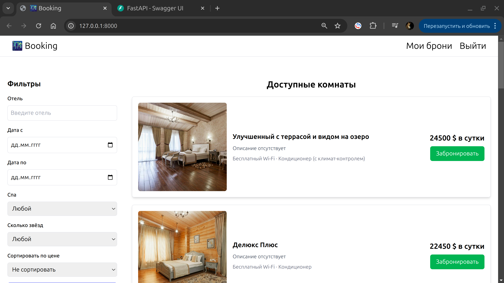
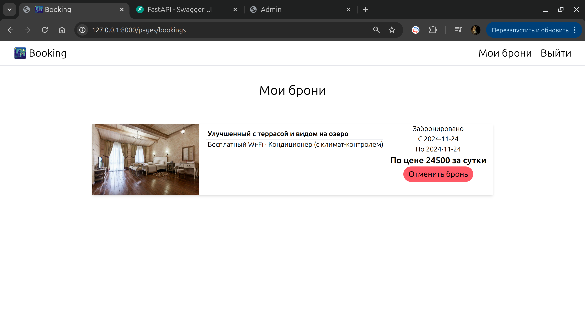
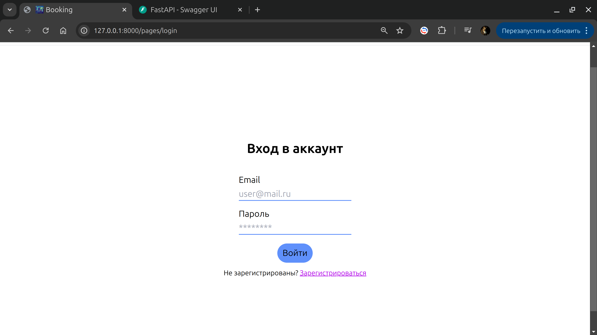
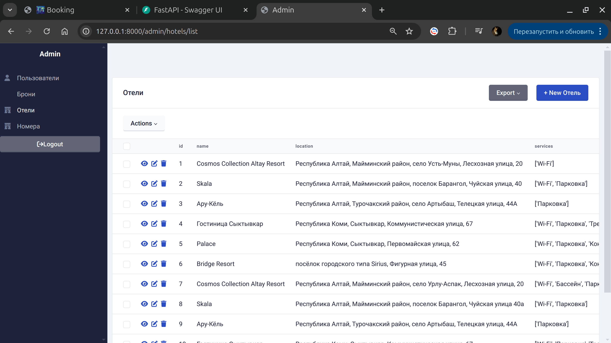
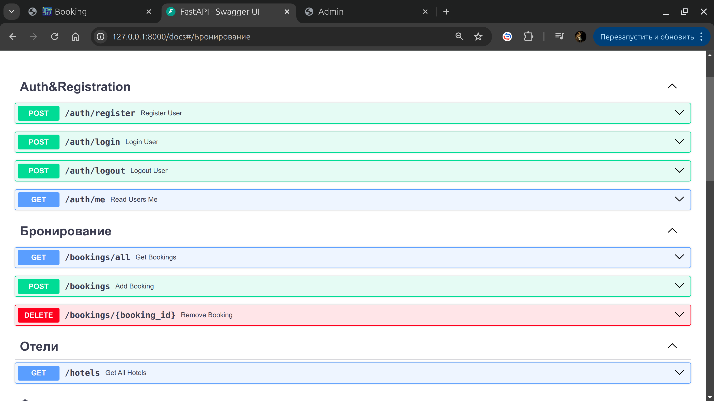
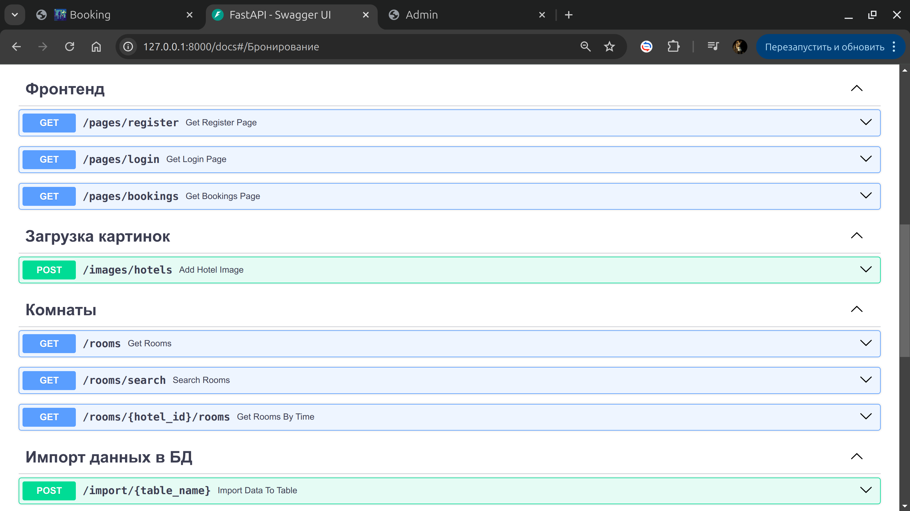

🌃 Booking Hotels

### 📖 Описание
**Hotel Booking System** — это веб-приложение, позволяющее пользователям бронировать номера в отелях, управлять бронированиями и получать информацию о доступных номерах. В основе разработки приложения веб-фреймворк FastAPI.

Графический интерфейс.

### Список доступных номеров


### Забронированные номера


### Аутентификация


### Админка


### Эндпоинты



---

## 🌟 Функционал
- Бронирование номеров.
- Управление существующими бронированиями(удаление).
- Авторизация и регистрация пользователей.
- Панель администратора для управления номерами и бронированиями.
---

## 🛠️ Используемые технологии
- **Backend**: Python 3.12, FastAPI, Redis
- **База данных**: PostgreSQL,sqlalchemy
- **Фоновые задачи**: Celery, flower
- **Контейнеризация**: Docker, docker-compose
- **Тестирование**: для тестирования был использован pytest
---


### 🔧 Установка и запуск с Docker


1. **Создайте файл `.env`** на основе предоставленного шаблона `.env-example`:
    ```plaintext
    DATABASE_URL=postgresql://user:password@db:5432/hotel_booking
    SECRET_KEY=your_secret_key
    ```

2. **Соберите и запустите контейнеры**:
    ```bash
    docker-compose up --build
    ```

4. **Откройте приложение** в браузере:
    - API: [http://localhost:8000](http://localhost:8000)
    - Документация Swagger: [http://localhost:8000/docs](http://localhost:8000/docs)

---

### 💻 Установка и запуск без Docker


1. **Создайте виртуальное окружение** и активируйте его:
    ```bash
    python -m venv venv
    source venv/bin/activate  # для Linux/macOS
    venv\Scripts\activate     # для Windows
    ```

2. **Установите зависимости**:
    ```bash
    pip install -r requirements.txt
    ```

3. **Создайте файл `.env`** на основе `.env-example`.

4. **Выполните миграции** для настройки базы данных:
    ```bash
    alembic upgrade head
    ```

5. **Запустите локальный сервер разработки**:
    ```bash
    uvicorn app.main:app --reload
    ```

6. **Откройте приложение** в браузере:
    - API: [http://localhost:8000](http://localhost:8000)
    - Документация Swagger: [http://localhost:8000/docs](http://localhost:8000/docs)

---
